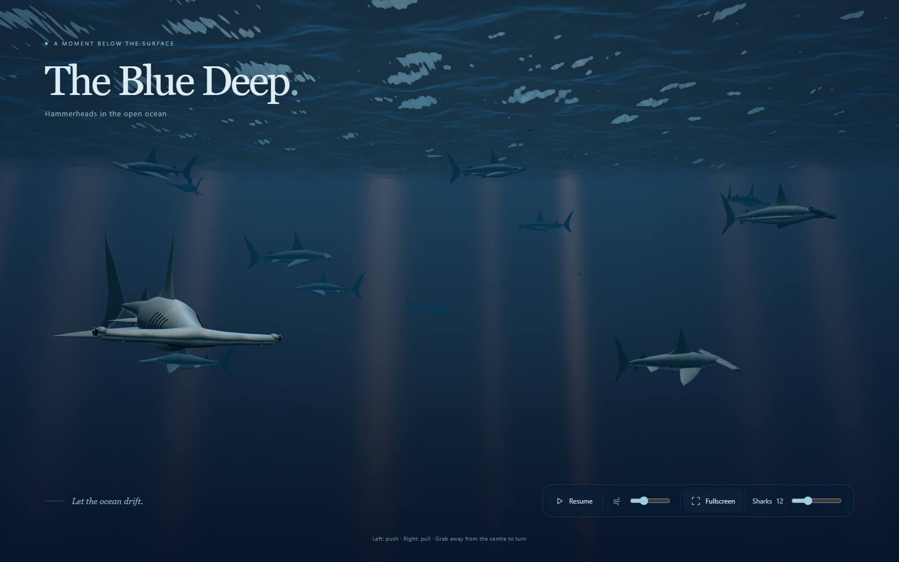

# Hammerheads · The Blue Deep

An interactive 3D screensaver with hammerhead sharks in a deep blue ocean. Waves, sunbeams, swimming and shark models are rendered directly in the browser using Three.js. All required files are included, so the scene also works offline.

## Getting started

1. Download the project as a ZIP file or clone the repository.
2. Extract all files into the same folder.
3. Open `index.html` in Chrome or Edge with graphics acceleration enabled.

No installation, server or build step is required. This is a browser screensaver; it does not install itself as a Windows screensaver or desktop wallpaper.

## Controls

1. **Fullscreen:** Click the button, press F or double-click the open water. Press Esc to exit fullscreen.
2. **Pause:** Click Pause or press Space. Repeat to resume.
3. **Swimming speed:** Adjust the slider with the speed icon.
4. **Shark count:** Select 0–40 using the Sharks slider. Some sharks may swim outside the field of view.
5. **Push:** Hold the left mouse button on a shark to push it deeper into the water.
6. **Pull:** Hold the right mouse button on a shark to pull it closer. Move the mouse to steer sideways at the same time.
7. **Turn:** Grab the head, tail or fins. Force near the body centre mainly moves the shark; force farther from the centre also rotates it.
8. **Touch:** Drag with one finger to move a shark in the screen plane and turn it.

Sharks follow with elastic motion and retain some momentum and rotation after release. You can also move them while paused. Controls fade out after inactivity and reappear with mouse, touch or keyboard input.

## Ocean and lighting

Lighting follows your computer's local clock and turns orange-red at low sun angles. The visual day cycle uses sunrise at 06:00, the highest sun at 12:00 and sunset at 18:00. It does not calculate the sun's position from your location or the season.

Surface reflection and refraction depend on the viewing angle, wave slope and the refractive index of water. The sky, underwater environment and sunbeams are simplified visual models. See the [detailed guide](GUIDE.md).

## Files

| File | Contents |
| --- | --- |
| `index.html` | Page and controls |
| `ocean.css` | Layout and appearance |
| `ocean.js` | Shark models, animation, physics, lighting and interaction |
| `three.min.js` | Local Three.js r160 library |
| `THREE-LICENSE` | MIT licence for Three.js |
| `GUIDE.md` | User guide and technical limitations |
| `LICENSE` | GPLv3 licence for this project |

The scene is silent and makes no network requests. A hidden browser tab stops rendering. If your system requests reduced motion, the scene starts paused.

## Licence

Hammerheads is open source under the **GNU General Public License v3.0 (GPLv3)**, the same licence as T1D Simulator. See [LICENSE](LICENSE) for the full terms.

Copyright © 2026 Kristian R. Harreby.

The bundled Three.js library retains its own MIT licence in [THREE-LICENSE](THREE-LICENSE).
